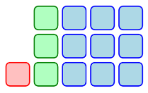

# Raddy
An automatic differentiation system for geometry and simulation.
> An attempt to port some portion of [TinyAD](https://github.com/patr-schm/TinyAD) to Rust.

# Usage

First add to your `Cargo.toml`:
```toml
raddy = "*"
```

## Scalars
```rust
use raddy::make::var;
use rand::{thread_rng, Rng};

fn example_scalar() {
    // 1. Scalar
    let mut rng = thread_rng();
    let val = rng.gen_range(0.0..10.0);

    let x = var::scalar(val);
    let x = &x; // Please read the Note section in README.
    let y = x.sin() * x + x.ln();

    dbg!(y.grad()[(0, 0)]);
    dbg!(y.hess()[(0, 0)]);
}
```

## Vectors
```rust
use nalgebra::{Const, SVector};
use raddy::{make::var, Ad};
use rand::{thread_rng, Rng};

fn example_matrix() {
    // 2. Vector
    // initialize, boilerplate code
    let mut rng = thread_rng();
    const N_TEST_MAT_4: usize = 4;
    type NaConst = Const<N_TEST_MAT_4>;
    const N_VEC_4: usize = N_TEST_MAT_4 * N_TEST_MAT_4;

    let vals: &[f64] = &(0..N_VEC_4)
        .map(|_| rng.gen_range(-4.0..4.0))
        .collect::<Vec<_>>();

    // Core logic. You can do any kind of reshaping.
    let s: SVector<Ad<N_VEC_4>, N_VEC_4> = var::vector_from_slice(vals);
    let transpose = s
        .clone()
        // This reshape is COL MAJOR!!!!!!!!!!!!!
        .reshape_generic(NaConst {}, NaConst {})
        .transpose();
    let z = transpose;
    let det = z.determinant();

    dbg!(det.grad());
    dbg!(det.hess());
}
```

## Sparse
1. First define your per-element (per-stencil) objective:
```rust
struct SpringEnergy {
    k: f64,
    restlen: f64,
}

// 2d * 2nodes = 4dof
impl ObjectiveFunction<4> for SpringEnergy {
    fn eval(&self, variables: &raddy::types::advec<4, 4>) -> raddy::Ad<4> {
        let p1 = advec::<4, 2>::new(variables[0].clone(), variables[1].clone());
        let p2 = advec::<4, 2>::new(variables[2].clone(), variables[3].clone());

        let len = (p2 - p1).norm();
        // Hooke's law
        let potential = val::scalar(0.5 * self.k) * (len - val::scalar(self.restlen)).powi(2);

        potential
    }
}


```
1. Then, define your elements (indices). Here is an example where each element is DOFs of two nodes on each neo-hookean spring:
```rust
let springs = vec![[0, 1, 2, 3], [2, 3, 4, 5], [0, 1, 4, 5]];
let x0 = faer::col::from_slice(&[0.0, 0.0, 2.0, 0.0, 1.0, 2.0]).to_owned();

let obj = SpringEnergy {
    k: 10000.0,
    restlen: 1.0,
};
```
3. Finally, compute:
```rust
let computed: ComputedObjective<4> = obj.compute(&x0, &springs);

/*
pub struct ComputedObjective<const N: usize> {
    pub value: f64,
    pub grad: Col<f64>,
    pub hess_trips: Vec<(usize, usize, f64)>,
}
*/
```

Please see `src/examples` and `src/test` for details.

# Notes
1. `Copy` is **not** implemented for `Ad<N>` types, since its cost is not negligible.
- This reminds you to (in most cases) use a borrow type `&Ad<N>` to call methods on `&Ad<N>`; or to explicitly clone it if the cost is acceptable.

# Progress

- [x] Univariate
  - [x] Gradient
  - [x] Hessian
  - [x] Tests
- [x] Multivariate
  - [x] Gradient
  - [x] Hessian
  - [ ] Tests
    - [x] Norm
    - [x] Determinant
    - [x] Matmul
- [ ] Get nalgebra as well as compiler happy
  - [x] Implement `ComplexField` for `&Ad<N>` (Not `Ad<N>`) (a huge task that may involve codegen/metaprogramming...)
  - [ ] Incrementally implement the trait in `ComplexField` if some methods need them
- [ ] Sparse interface
  - [x] Define sparse problem (generic on problem size)
  - [x] Compute sparse problem
  - [ ] Test
    - [x] Mass spring: grad/hess
    - [x] Mass spring: results
    - [ ] Neo Hookean
  - [x] Make an example: [mass-spring system](https://github.com/Da1sypetals/Raddy-examples)
- [ ] An option to allocate hessian on heap
- [ ] `f64` & `Scalar` Interop (How to? Seems sort of impossible due to [orphan rule](https://doc.rust-lang.org/book/ch10-02-traits.html)) (We use the same sort of workaround as `faer`)


># Notes For Myself
>1. Test code makes use of [Symars](https://github.com/Da1sypetals/Symars), which generates Rust code from SymPy expressions.
>2. When getting numerical bugs, **First check the argument order of symars generated functions**!!!
